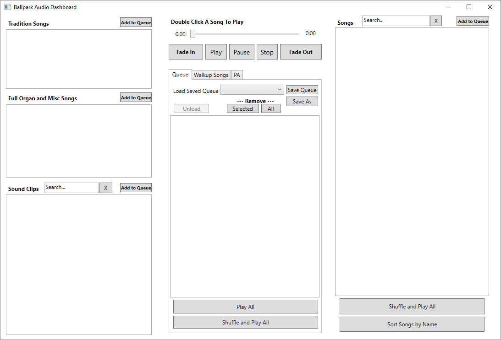

# Ballpark Audio Dashboard
An audio application that assists your public address announcer at your ballpark.

Features
 - Fade in and out of the currently playing audio
 - Use multiple media players to fade out of one and into another
 - Build your own persist-able playlist of Sound Clips or Songs that fits your tastes
 - Separate lists for Sound Clips versus Songs
 - Shuffle and play all modes used for batting practice or pre-game time periods
 - Search Songs and Sound Clips for each list
 - Search all music in a single dialog and add to either media player
 - Walk-up songs lists
 - Use text-to-speech to announce batters or enter custom text

